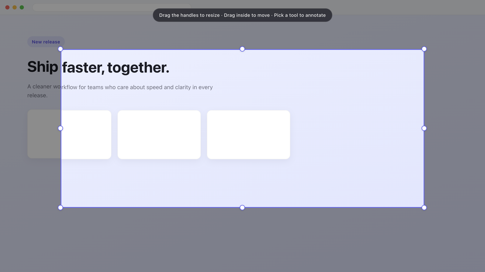
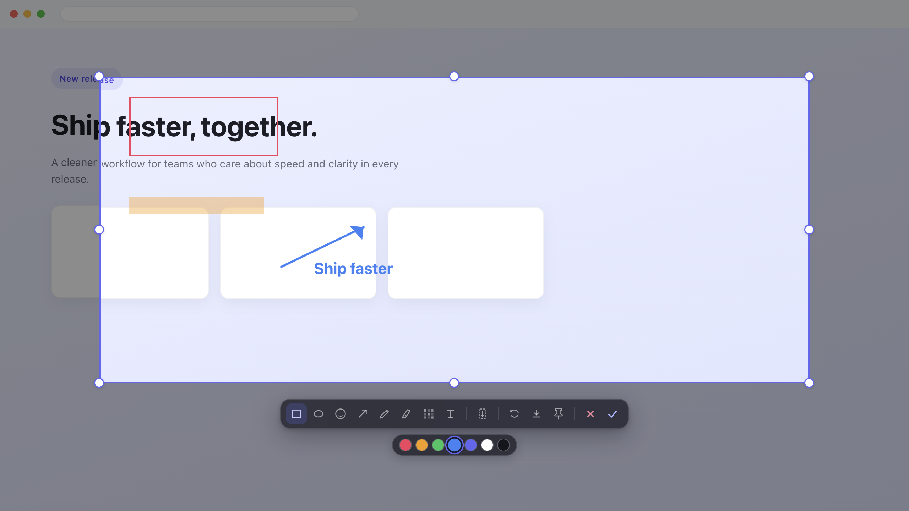
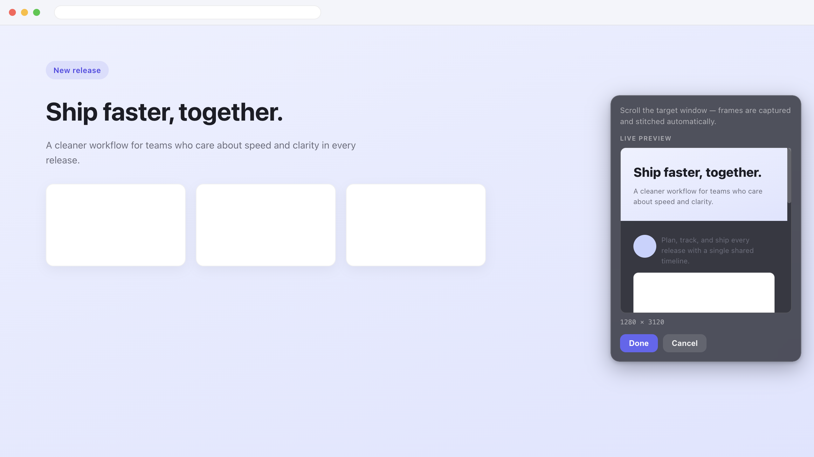

<div align="center">


# LiteSnap

**截图 · 标注 · 贴屏 · 搞定**

轻量快速的 Windows 与 macOS 截图、标注工具。

[English](./README.md) · **简体中文** · [繁體中文](./README.zh-TW.md)

<br />

[](https://github.com/HuibingLin/LiteSnap/releases/download/v2.0.1/LiteSnap_2.0.1_x64-setup.exe)
[](https://github.com/HuibingLin/LiteSnap/releases/download/v2.0.1/LiteSnap_2.0.1_universal.dmg)
[](./LICENSE)
[](#下载)

</div>

---

## 下载

**Windows 和 macOS 现已开放下载。** macOS Universal DMG 已使用 Developer ID 签名并通过 Apple 公证，同时支持 Apple Silicon 与 Intel Mac，最低支持 macOS 10.15。

最新版：**[v2.0.1](https://github.com/HuibingLin/LiteSnap/releases/tag/v2.0.1)** · [全部版本](https://github.com/HuibingLin/LiteSnap/releases)

| 版本 | Windows | macOS | 说明 |
|:----:|:-------:|:-----:|:-----|
| **v2.0.1** | [LiteSnap_2.0.1_x64-setup.exe](https://github.com/HuibingLin/LiteSnap/releases/download/v2.0.1/LiteSnap_2.0.1_x64-setup.exe) | [LiteSnap_2.0.1_universal.dmg](https://github.com/HuibingLin/LiteSnap/releases/download/v2.0.1/LiteSnap_2.0.1_universal.dmg) | Windows 贴屏更稳定、取消操作可恢复、适配不同 DPI 的真实尺寸，并正式提供已签名和公证的 macOS Universal 版本 |
| v2.0.0 | [LiteSnap_2.0.0_x64-setup.exe](https://github.com/HuibingLin/LiteSnap/releases/download/v2.0.0/LiteSnap_2.0.0_x64-setup.exe) | 稍后上线 | 从 Electron 迁移到 Tauri，安装包更小、启动更轻 |
| v1.0.1 | [LiteSnap-1.0.1-setup.exe](https://github.com/HuibingLin/LiteSnap/releases/download/v1.0.1/LiteSnap-1.0.1-setup.exe) | 即将推出 — 如需 macOS 请[提交 Issue](https://github.com/HuibingLin/LiteSnap/issues) | 旧版公开 Windows 版本 |

> macOS 首次启动时会要求“屏幕与系统录音”权限，以便 LiteSnap 截取屏幕。安装包已通过 Apple 公证，无需绕过 Gatekeeper 即可正常打开。

---

## 简介

按下全局快捷键，拖拽框选区域，标注后即可复制、保存或贴到屏幕上——几秒完成。专注日常截图与无缝长截图。

## 预览

<p align="center">
  <br />
  <em>框选区域后可调整大小与位置，再开始标注</em>
</p>

<p align="center">
  <br />
  <em>矩形、画笔、荧光笔、马赛克、文字、表情贴纸等</em>
</p>

<p align="center">
  <br />
  <em>滚动长截图，实时预览拼接进度</em>
</p>

<p align="center">
  <br />
  <em>截图以真实尺寸悬浮置顶，方便对照</em>
</p>

## 功能

- **全局快捷键** — 任意应用中唤起（macOS `⌥A`，Windows `Ctrl+Shift+A`，可自定义）
- **区域可调** — 截图后拖动手柄改大小、拖动内部移动位置
- **标注工具** — 矩形、椭圆、箭头、画笔、荧光笔、马赛克、文字、表情贴纸
- **滚动长截图** — 浏览器 / PDF / 聊天窗口无缝拼接，带实时预览
- **贴在屏幕** — 截图以真实尺寸悬浮置顶
- **托盘常驻** — 不占 Dock / 任务栏；支持英文、简体、繁体

## v2.0.1 修改与提升

- **Windows 贴屏更稳定** — 修复点击贴屏后一直显示“处理中”的问题，置顶贴图窗口可以安全复用。
- **取消后可继续截图** — 取消操作会及时退出当前截图流程，不再造成下一次全局快捷键失效。
- **贴图保持真实尺寸** — Windows 在 100%、125%、150% 显示缩放及多屏环境下，贴图尺寸与所选截图区域一致。
- **调整大小更可控** — 只有用户主动拖动调整手柄时才修正宽高比，新贴图不会错误套用上一张图片的比例。
- **图片传输更轻量** — Windows 使用单个 base64 载荷并在后台线程解码，避免大量 JSON 数组导致 WebView2 卡顿。
- **完整显示截图** — 贴图边框改为覆盖绘制，不再挤占或缩小图片显示区域。

## 为什么是 v2.0.0

- Electron 安装包体积太大，所以 LiteSnap 迁移到 Tauri，降低安装包体积，也让启动更轻。
- Windows 版本先发布，以便尽快交付稳定安装包并完成测试。
- Apple Developer 签名和公证完成后，macOS 已在 v2.0.1 正式提供同时支持 Apple Silicon 与 Intel Mac 的 Universal DMG。

## 旧版技术栈说明

旧版技术栈：Electron · electron-vite · React 19 · TypeScript · Zustand · electron-builder

新版技术栈：Tauri 2 · Rust · React 19 · TypeScript · Zustand

## 开发

```bash
cd app
npm install
npm run dev
```

### 打包安装包

```bash
cd app
npm run build:win         # → src-tauri/target/x86_64-pc-windows-msvc/release/bundle/nsis/LiteSnap_2.0.1_x64-setup.exe
npm run build:mac         # → src-tauri/target/release/bundle/macos/LiteSnap.app
npx tauri build --bundles dmg --target universal-apple-darwin
                          # → src-tauri/target/universal-apple-darwin/release/bundle/dmg/LiteSnap_2.0.1_universal.dmg
```

## 许可证

[MIT](./LICENSE) © HuibingLin
